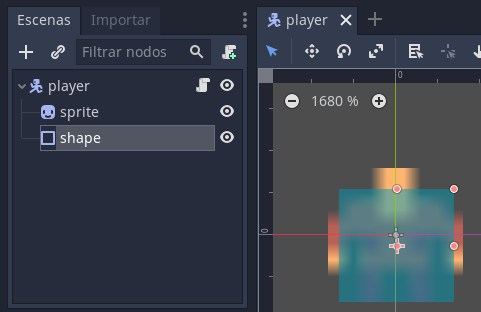

[<< back](README.md)

# Preparativos

## Instalar software

Vamos a instalar el motor GodotEngine (versión 3.2)
* Descargamos un fichero zip de la web godotengine.org.
* Creamos una carpeta `godot/bin` y descomprimos el fichero.
* Como resultado tendremos un ejecutable que ya se puede usar.

Otro software recomendado:
* Instalar GIMP (Software de edición de gráficos). Lo podemos descargar de la página web de www.gimp.org.

## Roles

Para crear un videojuegos hay muchos caminos. Podemos hacer un desarrollo indie, donde nos encargamos de hacerlo todo sin ayuda de nadie. O también podemos estar en una gran empresa de creación de juegos donde formamos parte de un gran equipo y cada uno se encarga de una pequeña parte. De hecho hay muchas funciones diferentes a la hora de crear un juego, pero nosotros lo vamos a simplificar en 3 roles:
1. Rol del artista
1. Rol del programador
1. Rol del diseñador del juego

El artista es el encargado de crear los gráficos, sprites, texturas, modelos 3D,etc. El programador se encarga de... programar. Y el diseñador del juego es quien tiene la idea de cómo debe ser el juego. El diseñador es el creativo que da instrucciones a los artistas y programadores para llevar a cabo el proyecto.

En esta serie de tutoriales, sólo nos vamos a centrar en el rol del programador. En la parte artística haremos uso de recursos con licencia libre y el la parte de diseño... bueno ahí vamos a ser poco originales y vamos a imitar otros diseños que ya existen. Porque nos vamos a centrar en el rol del programador.

## Assets

Los assets son los recursos tanto gráficos como de sonido o música que hacen los artistas y que necesitamos para nuestro juego. Existen algunas web donde podemos descargar assets con licencia libre, por ejemplo:
* [Kenney](https://www.kenney.nl/)
* [Game-Icons.net](https://game-icons.net/)
* spriter-resource
* itch.io

Nosotros vamos descargar de la web de Kenney los assets de "miniroguelike".

## Organizando las carpetas

* Creamos el siguiente directorio `godot/demo/roguelike`.
* Dentro vamos a crear la siguiente estructura de directorio:

```
├── actor
│   ├── enemy
│   └── player
├── assets
│   ├── actors
│   ├── objects
│   └── tiles
├── level
└── object
```
* Iniciamos `godot -> Nuevo proyecto`.
* `Examinar` para buscar la carpeta `godot/demo/roguelike` y `Seleccionar carpeta`
* Poner nombre al proyecto `roguelikeXX` (NOTA: XX es el número asignado a cada alumno).
* `Crear y editar`

---
## Level 1

En Godot se utilizan las escenas y los nodos para crear el juego.
* Las escenas las usamos para crear cada elemento del juego de forma independiente. Al final haremos un escena que contenga al resto y ya tenemos el juego. Las escenas serían como clases en programación orientada a objetos.
* Los nodos dan funcionalidad o habilidades a las escenas. En principio vamos a usar los nodos que nos proporciona Godot y si nos falta algún nodo más siempre podremos crear los nuestros a medida.

Vamos a crear la primera escena del juego.
* Usamos el símbolo `+` para añadir nodos a la escena.
* Elegimos **Node2D** porque es la base para montar juegos 2D. Renombrar el nodo a `level`.
* Escena guardar como `res::/level/level1.tscn`.
* Pulsar F5 para ejecutar el juego. Bueno, por ahora sólo tenemos una pantalla en gris oscuro.

> NOTA:
> * F5 => probar el juego desde el principio
> * F6 => probar escena actual

## Player

Ahora vamos a crear otra escena, para crear a nuestro personaje principal.
* `Escenas -> Nueva escena`
* En la ventana "árbol de nodos" vamos a añadir los siguientes nodos:


* Empezamos con un nodo raíz de tipo **KinematicBody2D** al que hemos renombrado como `player` (Usamos el símbolo `+` para añadir nodos a la escena).

Hemos elegido este nodo porque nos proporciona el comportamiento de un cuerpo físico, que necesitamos para conseguir colisiones con el resto de cuerpos físicos de la escena. Esto es, las paredes de la mazmorra.

* Añadir un nodo hijo de tipo **Sprite** al que renombraremos como `sprite`.
* Seleccionando el nodo `sprite`, vemos en la ventana inspector las propiedades de este nodo. En la propiedad texture vamos a cargar la imagen `assets/actor/tile_004.png`.

Añadimos un nodo sprite para incorporar imágenes 2D a nuestra escena.

* Añadir otro nodo hijo al nodo raíz, de tipo **CollisionShape2D** y lo renombramos como `shape`.
* Seleccionando el nodo `shape`, vamos a la ventana inspector y en la propiedad Shape elegir `RectangleShape2D`. Ajustamos el tamaño del rectángulo para ajustarlo lo mejor posible al tamaño y forma de nuestro sprite.



* Grabar la escena que acabamos de crear como `actor/player/player.tscn`.

## Level 1

* Volvemos a la escena `level` que sólo tiene un nodo.
* Al lado del símbolo "+" tenemos la "cadena" (instanciar objeto). Lo usamos para añadir la escena `player` como un nodo hijo dentro de `level`.
* En la parte superior de Godot elegimos visión "2D". Podemos mover el `player` para moverlo al centro de la ventana o bien usar las propiedades de la ventana inspector y asignar el valor de posición `Node2D/Transform/Position` con x = 100 e y = 74.
* Seleccionamos el nodo `level`, y en la ventana inspector, buscamos la propiedad `Node2D/Scale`. Ponemos los valores x=4 e y=4. Para hacer un escalado de todos los nodos de la escena. Esto lo hacemos porque tenemos unas imágenes muy pequeñas (8x8) y queremos que se vean un poco más grandes (32x32).
* **Pulsar F5** y vemos nuestro juego con un personaje que no se mueve.


En la siguiente parte vamos a darle movimiento al player.

[Siguiente](02-mover.md)
