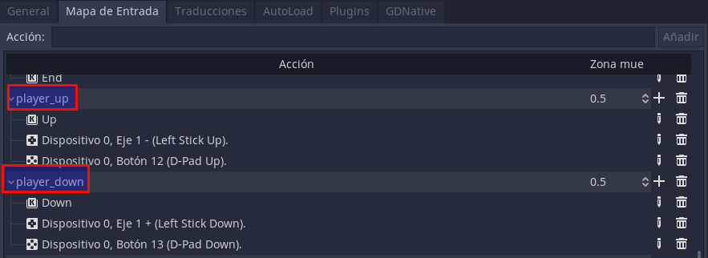

[<< back](README.md)

# Darle vida a Player

## Entradas de teclado

Dentro de nuestro proyecto de Godot:
* Vamos `Proyecto -> Ajustes del proyecto -> Mapa de Entradas`. Aquí vamos a definir las entradas (teclado, joystick, etc) que vamos a usar para interactuar con el juego.
* Añadimos las siguientes definiciones:




## Script

Vamos a crear nuestro primer script para que el personaje responda a las entradas del teclado/joystick.

* Abrir la escena `actor/player/player.tscn`.
* Seleccionamos el nodo raíz `player`.

Encima del árbol de nodos, vemos el símbolo de un pergamino con un "+". Este botón sirve para crear un script nuevo a nuestro nodo.
* Pulsamos el botón de crear script.
* Lo guardamos como `actor/player/player.gd` (Los script hechos en el lenguage de programación GDPython se guardan con la extensión gd).
* Ahora debemos estar viendo un script (Fichero de texto con instrucciones en GDPython). Si no lo vemos, en la parte superior tenemos los botones para cambiar la vista entre: 2D, 3D, Script y AssetLib. Seleccionamos la vista Script.
* Escribiremos el siguiente código:

```python
extends KinematicBody2D

export var speed = 12000 # Pixels/second

func _physics_process(delta):
	var motion = Vector2()

	if Input.is_action_pressed("player_up"):
		motion += Vector2(0, -1)
	if Input.is_action_pressed("player_down"):
				motion += Vector2(0, 1)
	if Input.is_action_pressed("player_left"):
		motion += Vector2(-1, 0)
	if Input.is_action_pressed("player_right"):
		motion += Vector2(1, 0)

	motion = motion.normalized() * speed * delta
	move_and_slide(motion)
```

* Con F5 podemos probar el resultado

## Vamos a explicar el script

* `extends KinematicBody2D`, esta instrucción determina que nuestro `player` va a heredar todas las habilidades de los KinematicBody2D. Con este mecanismo de reutilización de código (herencia) nos ahorraremos escribir mucho código.
* `var speed`, creamos una variable `speed` que guardará el valor que define la velocidad de movimiento del personaje. Ajustaremos este valor después de hacer algunas pruebas.
* `func _physics_process(delta):`, es la forma de definir una función con el nombre `_physics_process`. Una función es un bloque de código con un nombre. Esta función en concreto se ejecuta periódicamente para procesar los cambios que van a tener lugar en el juego. Dentro de esta función se comprueba si se ha pulsado alguna de las teclas Up, Down, Left o Right y hace los cambios de posición del personaje.
* `motion` es un vector 2d que define el movimiento o cambio que se va a aplicar a la posición actual del personaje. Como estamos en un juego 2D, sólo tenemos dos coordenadas (X e Y), y nos basta con un vector 2D para definir posiciones y movimientos en 2D.
* `if Input.is_action_pressed("player_right"):`, Si por ejemplo se detecta que se ha activado la entrada correspondiente a "player_right", entonces `motion += Vector2(1, 0)`. Esto es la variable motion guardará el valor de un vector 2D que indica que aumentaremos el valor de la coordenada X y que no cambiará el valor de la coordenada Y.
* `motion = motion.normalized() * speed * delta`. `motion` es el vector que indica la dirección del movimiento, `speed` es la velocidad y `delta`  es el tiempo. Por la fórmula "espacio = velocidad * tiempo", se calcula cuándo se desplazará el personaje teniendo "velocidad * tiempo" (`speed * delta`).
* `move_and_slide(motion)`, esta orden intenta aplicar el cambio definido por la variable motion respetando las colisiones que se puedan producir. El personaje sólo se podrá mover en esa dirección, si no tiene otros objetos que colisionen y le impidan hacerlo (Según las leyes de la física del motor).

[Siguiente](03-tilemap.md)
