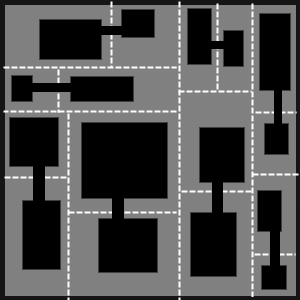

[<< back](procedural-content.md)

# BSP para la generación básica de mazmorras

> _Este tutorial es una traducción a español del artículo original [Basic BSP Dungeon generation - RogueBasin](http://roguebasin.roguelikedevelopment.org/index.php?title=Basic_BSP_Dungeon_generation)_

Vamos a ver cómo usar un árbol BSP para generar un mapa de mazmorras básico.

## 1. Construir el árbol BSP

Empezamos con una mazmorra rectangular rellena de celdas de tipo muro.
A partir de ahí iremos dividiendo esta mazmorra de forma recursiva, hasta que cada una de las sub-mazmorras tenga aproximadamente el tamaño de una habitación.

El proceso de división de las mazmorras es el siguiente:

1. **Elegir una dirección aleatoria**: Esto es, que de forma aleatoria elegimos si queremos dividir horizontalmente o verticalmente.
2. **Elegir una posición aleatoria**: x para vertical, y para horizontal.
3. **Dividir la mazmorra en dos sub-mazmorras**.

Veamos un ejemplo de la primera iteración de división.

Dentro de las mazmorras A y B, podemos volver a aplicar el mismo proceso de división. Veamos un ejemplo de la segunda iteración de división.

Cuando elegimos la posición de división (paso 2 del proceso), hay que tener cuidado para no elegir una demasiado cerca del borde de la mazmorra, puesto que necesitamos tener espacio suficiente en cada sub-mazmorra para colocar una habitación dentro.

Seguiremos repitiendo el proceso hasta que la sub-mazmorra más pequeña tiene aproximadamente el tamaño de las habitaciones que queremos generar.

Veamos un ejemplo después de aplicar 4 iteraciones de división:

Los valores de la posición de división dan distintos resultados:
* Sub-mazmorras homogéneas si el valor está entre 0.45 y 0.55.
* Sub-mazmorras heterogéneas si el valor está entre 0.1 y 0.9.

También se puede decidir usar recursión profunda, sólo en algunas partes de las mazmorras de modo que se consigan habitaciones más pequeñas en esas partes concretas.

## 2. Construyendo las mazmorras

Ahora vamos a crear habitaciones con tamaño aleatorio en cada hoja del árbol. Por supuesto, que cada habitación debe estar contenida dentro de su correspondiente sub-mazmorra. Gracias al árbol BSP, evitaremos que dos habitaciones se solapen.

Veamos un ejemplo de las habitaciones (rectágulos de color negro), dentro de cada hoja del árbol BSO (rectángulos de color gris).

## 3. Construir los pasillos

Para construir los pasillos, recorreremos todas las hojas del árbol, conectando cada hoja con su hermana. Si dos habitaciones tienen paredes cara a cara, podremos crear un pasillo recto. En caso contrario tenemos que usar un pasillo en forma de Z.

Veamos ejemplo conectando sub-mazmorras del nivel 4.

Ahora que hemos hecho los pasillos en el nivel 4 del árbol, subimos un nivel en el árbol y repetimos el proceso para las regiones del padre. Ahora podemos conectar dos sub-regiones con un enlace entre:
* dos habitaciones
* un pasillo y una habitación
* o entre dos pasillos.

Veamos un ejemplo donde se conectan las sub-mazmorras del nivel 3.

Repetimos el proceso hasta que terminemos conectando las primeras sub-mazmorras A y B.

Si permitimos que algunas habitaciones ocupen la hoja completa, se consiguen mazmorras menos aburridas.
