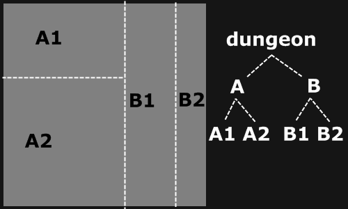
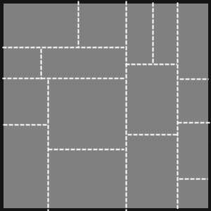

# Procedural content generators (PCG)

> Enlaces de interés:
> * [EN - Generate Random Cave Levels Using Cellular Automata](https://gamedevelopment.tutsplus.com/tutorials/generate-random-cave-levels-using-cellular-automata--gamedev-9664)

# BSP para la generación básica de mazmorras

> Enlaces de interés:
> * [EN - Basic BSP Dungeon generation - RogueBasin](http://roguebasin.roguelikedevelopment.org/index.php?title=Basic_BSP_Dungeon_generation)

Vamos a ver cómo usar un árbol BSP para generar un mapa de mazmorras básico.

## 1. Construir el árbol BSP

Empezamos con una mazmorra rectangular rellena de celdas de tipo muro.
A partir de ahí iremos dividiendo esta mazmorra de forma recursiva, hasta que cada una de las sub-mazmorras tenga aproximadamente el tamaño de una habitación.

El proceso de división de las mazmorras es el siguiente:

1. **Elegir una dirección aleatoria**: Esto es, que de forma aleatoria elegimos si queremos dividir horizontalmente o verticalmente.
2. **Elegir una posición aleatoria**: x para vertical, y para horizontal.
3. **Dividir la mazmorra en dos sub-mazmorras**.

Veamos un ejemplo de la primera iteración de división.

Dentro de las mazmorras A y B, podemos volver a aplicar el mismo proceso de división. Veamos un ejemplo de la segunda iteración de división.

Cuando elegimos la posición de división (paso 2 del proceso), hay que tener cuidado para no elegir una demasiado cerca del borde de la mazmorra, puesto que necesitamos tener espacio suficiente en cada sub-mazmorra para colocar una habitación dentro.

Seguiremos repitiendo el proceso hasta que la sub-mazmorra más pequeña tiene aproximadamente el tamaño de las habitaciones que queremos generar.

Veamos un ejemplo después de aplicar 4 iteraciones de división:

