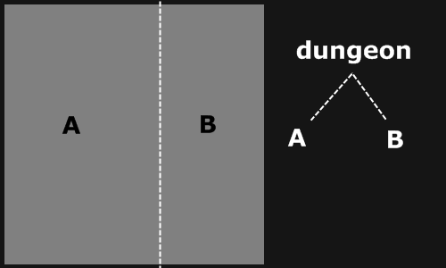

# Procedural content generators (PCG)

> Enlaces de interés:
> * [EN - Generate Random Cave Levels Using Cellular Automata](https://gamedevelopment.tutsplus.com/tutorials/generate-random-cave-levels-using-cellular-automata--gamedev-9664)

# BSP para la generación básica de mazmorras

> Enlaces de interés:
> * [EN - Basic BSP Dungeon generation - RogueBasin](http://roguebasin.roguelikedevelopment.org/index.php?title=Basic_BSP_Dungeon_generation)

Vamos a ver cómo usar un árbol BSP para generar un mapa de mazmorras básico.

**Construir el BSP**

Empezamos con una mazmorra rectangular rellena de celdas de tipo muro.
A partir de ahí iremos dividiendo esta mazmorra de forma recursiva, hasta que cada una de las sub-mazmorras tenga aproximadamente el tamaño de una habitación.

El proceso de división de las mazmorras es el siguiente:

1. Elegir una dirección aleatoria: Esto es, que de forma aleatoria elegimos si queremos dividir horizontalmente o verticalmente.
1. Elegir una posición aleatoria: x para vertical, y para horizontal.
1. Dividir la mazmorra en dos sub-mazmorras.

Veamos la primera iteración de división.

