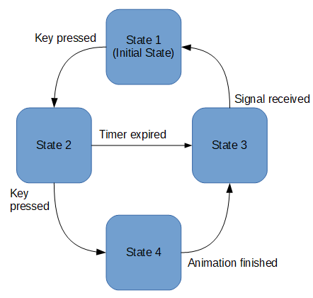

[<< back](../README.md)

# Máquina de estados

> Traducción al español del artículo "Godot State Machine" (https://gdscript.com/godot-state-machine)

En este tutorial exploraremos cómo controlar el estado de tu juego para que no se salga fuera de control.
La "Máquina de Estados Finitos" (FSM) es una excelente forma manera para lograrlo.

En cualquier punto de nuestro juego, los objetos del juego estarán en un estado concreto como: Waiting, Jumping, y Running.  
Cuando ocurra algún evento o se pulse una determinada tecla será cuando se podrá cambiar a otro estado.

Podríamos organizar nuestro juego con un diagrama de estados (Nodos), representando con flechas las transiciones entre estados. En cada transición indicaremos el evento que la dispara.

Veamos un ejemplo:



Por lado tendremos un nodo por cada estado, y cada nodo estado tendrá un script (código) asociado con:
* una función de entrada (`enter`),
* una función de salida (`exit`), y
* una función con la lógica interna (`update`) que envíe eventos y ejecute el código del Game Loop.

Para controlar la máquina de estados, tendremos un nodo raíz que contendrá a todos los nodos estado. Nosotros usaremos el siguiente ejemplo:

```
player
├── shape
├── sprite
└── states
    ├── attack
    ├── jump
    └── move
```

Donde `player` es el nodo raíz, y que actuará como el controlador de la máquina de estados, y los nodos `states/*`, serán todos los posibles estados.

Tanto el nodo `player` como `states/*`, tendrán asociado un fichero con código GDScript. El script `player.gd` tendrá funciones para cambiar el estado, responder a los eventos, y proporcionar mecanismos para volver al estado anterior.
